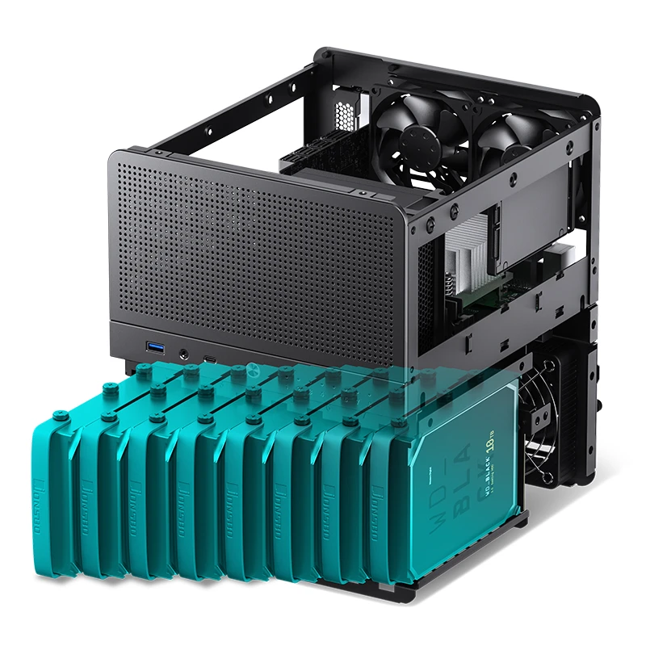

# NAS Nano

> My personal cloud platform and digital ecosystem — keeping my data safe, accessible, and automated

  
  

## Index
- [About](#about)
- [Parts List](#parts-list)
- [Build Process](#build-process)
- [Install OS](#install-os)

## About
**Why**
- [Cloud storage = renting your data forever](https://www.google.com/aclk?sa=L&ai=DChsSEwjd8rWKtsOPAxWzM0QIHaI0EUMYACICCAEQABoCZHo&ae=2&co=1&ase=2&gclid=CjwKCAjwlOrFBhBaEiwAw4bYDVFJtEVmHAiWWus9C_fR6T9uFj8nsmqRqwuAlSRycUebBu9VIe9daxoCo-wQAvD_BwE&cid=CAASJeRoM32ydEo4Mj6KEJXtGzYshves0OKPl_nKTWlpffLx7Kn6RNc&cce=2&category=acrcp_v1_71&sig=AOD64_38ICUXGpzQKsSPhOBgZoR0--2NYw&q&nis=4&adurl&ved=2ahUKEwjV5LCKtsOPAxXfOkQIHXtSJNYQ0Qx6BAgLEAE)

**This NAS will provide...**
- A secure, scalable, and automated personal cloud & file manager
- Self hosted password manager w/ private, encrypted credential storage
- Potentially a home media streaming server for movies, TV shows, and music
- ...

**This NAS will feature...**
- TrueNAS Scale OS with ZFS file management
- A compact M-ITX build in a Jonsbo N3 case for comfort + room for upgrades
- 16TB of storage to start

## Parts list
| Part | Name | Price | Buy | Notes |
|:-|:-|:-| :-| :-|
| Case | [Jonsbo N3 M-ITX 8 Bay](https://www.aliexpress.us/item/3256807958591638.html?spm=a2g0o.productlist.main.7.3c832b35XVtyJe&algo_pvid=1d325cdf-4ba8-400a-84b9-69d2097176e5&algo_exp_id=1d325cdf-4ba8-400a-84b9-69d2097176e5-6&pdp_ext_f=%7B%22order%22%3A%22431%22%2C%22eval%22%3A%221%22%2C%22orig_sl_item_id%22%3A%221005008144906390%22%2C%22orig_item_id%22%3A%221005007766707622%22%7D&pdp_npi=6%40dis%21USD%21275.17%21137.58%21%21%211952.98%21976.49%21%402102f0cc17571158551874876e214e%2112000043981297615%21sea%21US%212778608228%21X%211%210%21n_tag%3A-29919%3Bd%3Afbf213be%3Bm03_new_user%3A-29895&curPageLogUid=1esqV2X62dfx&utparam-url=scene%3Asearch%7Cquery_from%3A%7Cx_object_id%3A1005008144906390%7C_p_origin_prod%3A1005007766707622) | $138 | | |
| Case Fans | x | | | Case comes with 2 100mm HDD fans, fine for now? |
| Motherboard | [ASUS PRIME H610I-PLUS](https://www.amazon.com/ASUS-PRIME-H610I-PLUS-Motherboard-Mono-out/dp/B09XJQTQN1/ref=sr_1_1?crid=39LFB6UCM3GCK&dib=eyJ2IjoiMSJ9.j5Yw_YU_zxnkaY91q09RsHWbfm3Dc-OPQGDl6mrRyl_JdVGAwkv2iUwS6dwA3FquI-C9iFzxonZY4tLWnU1sCE2tbEmq15Ns-1hla7ofxlwtAc584sTed-xa09f0VD95MZ9pJVmPCRZnbf_y400H3GVYSbV65BRfHH-KWxyIbfciQDOiBUDopUSTR6ncrNVtL217hJsHatmIG1v4xa8kE_zFAnpq9O_uaoUClqV2Yxc.lmpkfZYz1GM-BCjJaZDZRUe11p3htWNurU-Bs4gRydc&dib_tag=se&keywords=ASUS+PRIME+H610I-PLUS+4+SATA&qid=1757113365&sprefix=asus+prime+h610i-plus+4+sata%2Caps%2C258&sr=8-1&ufe=app_do%3Aamzn1.fos.9fe8cbfa-bf43-43d1-a707-3f4e65a4b666) | $113 | | Supports integrated graphics, was used in recent N1 build |
| CPU | [Intel Core i3-12100](https://www.amazon.com/Intel-i3-12100-processor-Smart-Cache/dp/B09MDDX29R/ref=sr_1_3?crid=VCI3OZH2R0XV&dib=eyJ2IjoiMSJ9.G3NIyd_6HxgOi6kw6q1AcuFwScruZosK9m2UwhFG3Tv5OWRTDSPFpB5N-RX0sKWmi-pfKa39uzn6_QbaaqTJxE19WNHvT_Mpw0UnK4G7Z4d7RWM8w9fRpDAkPCeFrWlxeo9CwRaeeKGrtDEjHEyaETuZY_e1NXPkf2vUGqQBeKL8aaZwXS4ts8NqRdp2CNyJzq6sva1ipjXGxQzVFgJUSLd_p4eZfdh0p2Iw1ZtIS9g.ADnepAn8CNcbezIsCdLU6AYmxReb8z2S9Mj3bRmiMbo&dib_tag=se&keywords=Intel+Core+i3-12100&qid=1757112340&sprefix=intel+core+i3-12100%2Caps%2C186&sr=8-3&ufe=app_do%3Aamzn1.fos.9fe8cbfa-bf43-43d1-a707-3f4e65a4b666) | $113 | | Integrated Graphics |
| CPU Cooler | [Thermalright AXP90-X36](https://www.amazon.com/Thermalright-AXP90-X36-Profile-TL-9015B-Technology/dp/B0BV13553F/ref=sr_1_1?crid=2WPZAJM7R9Y8I&dib=eyJ2IjoiMSJ9.EJ6_Bgwjl26mAly-twZHMp9hwdToK0RTxw1kS7ManW-FtfsY6kYpB291Cq2gViSYM-XRyTwHgJHGY_fTeqLfx8_bYQRnZ9bSrbt7cWp52IWnW_giq9JXj8bZkA-YhLRZCioY0QMeAgbUdKvhYwipZlXFv_VY2Qub1pmkuVoy1yoPdABNVdLVD-yNP8CGjroFdeUnhwllq2qneoWwlGcu0WA1i2BYMpkk0S_ZmFVnJo8.yuRaCBWl4eeW3IqxX_Xr3Zt0DSTQr_MJqvcGdsTf19k&dib_tag=se&keywords=Thermalright%2BAXP90%2BSeries&qid=1757118654&sprefix=thermalright%2Baxp90%2Bseries%2Caps%2C163&sr=8-1&th=1) | $22 | |
| PSU | [Silverstone ST30SF V2](https://www.amazon.com/SilverStone-Technology-Factor-Bronze-ST30SF-V2-USA/dp/B07WM92Y4T/ref=sr_1_1?crid=1WPJEHYLYS1G4&dib=eyJ2IjoiMSJ9.VFgvDPRfuKDKCIRoSw_7eIU9uQgc5627dAD6TPHOLAS-4FMeSckLxvbDW_oCOjX-eNYRz-xJBZEAJqCGb5ozUvuLzBOxCGgN-e8IP4INs_feYTFmTpzk8I_JHjlpgVUHuudeoGOpnUW4P6u-wJB-m1PbmhqF-Yr9TNyQEJd6S-jFpx-0TlYqAZptK3wgkHxWyEVK28-KSCoSpS8GDU1rz6nhgVfTKoTcGdI4uEzF7GI.XquHhXNeoGobmuUla0lkO789cqii8gOiSqN97E_pJj8&dib_tag=se&keywords=SilverStone%2BST30SF-V2%2B300%2BW%2BSFX%2B(80%2BPLUS%2BBronze)&qid=1757112835&sprefix=fsp%2B550w%2Bsfx%2Bdagger%2Bpro%2Caps%2C361&sr=8-1&th=1) | $85 | |
| RAM | [CORSAIR VENGEANCE LPX DDR4 RAM 16GB](https://www.amazon.com/Corsair-VENGEANCE-3200MHz-Compatible-Computer/dp/B07RS1G6XW/ref=sr_1_2?crid=2CM7ENCFBYJK9&dib=eyJ2IjoiMSJ9.r1s1DniWVhlIH3HskYkjTaqH5po_p3BXDUHGO-2i_tduc8r5oqUrBmGJC059ZYvruoy5qR7zhiilht-ucMg5TKLT-JbMmmxGF8niXOOKaupYGMl9ZhGlQQ7FAgg_PJPW8TWbF9EEEJP06_rpmZiIW5I7fF38gIW9pa2rvYN8W2xN0uGt9bGc-gczxby5UL19nX7GOYoZiEIowKXWNwkYZgl2MWzy6jn1cyJAMBb5YLA.X_N4GfgtiovvUFdPnNWs9LsJMRRWKBb4TWwTIiYGUg0&dib_tag=se&keywords=Corsair+Vengeance+LPX+DDR4-3200&qid=1757116381&sprefix=corsair+vengeance+lpx+ddr4-3200%2Caps%2C282&sr=8-2) | $48 | |
| Boot SSD (NVMe) | [Patriot Memory P320 128GB](https://www.amazon.com/Patriot-P320-128GB-Internal-SSD/dp/B0D4RD18YV/ref=sr_1_5?crid=30SJVP6YUOR0A&dib=eyJ2IjoiMSJ9.AuUdwiEvQjxl6-O8arMSRacmYP7Epn806LGyiSjFukJgfQUERhsVN4_Gdhsp3klDYhOKq1008zC_Cvzyz3qAYbswYte14GiLjX4-Bkk6E3Yef9vE37FoJylB5Nab5McxiFoJ-wcq5Lhw_w2QoSeYmEusbpuElEDBgzXtkxfXf-f_ecav4KwL2M0X1DJzsg4YA2lcIGdlB0voP0UUEi-TKVF1kq2_SbXuzxc0OvocEfU.wNcctVda978FTY9JJpOIJ5is31RWr1gUgZ0Q5OrZBgE&dib_tag=se&keywords=nvme%2Bssd&qid=1757120200&sprefix=nvme%2Bssd%2Caps%2C234&sr=8-5&th=1) | $16 |  | TrueNAS needs bootdrive |
| Drives | 2 x WD Red Pro 8TB WD8001FFWX [LINK1](https://www.ebay.com/itm/267217302405) [LINK2](https://www.ebay.com/itm/286707247051) | $200 | X | CMR > SMR |
| SATA Cables | [3-Pack 90 Degree SATA Cable - 18 Inch](https://www.amazon.com/Cable-Matters-3-Pack-Degree-Right/dp/B018Y2LEBE/ref=sr_1_2_sspa?dib=eyJ2IjoiMSJ9.yBTbe_B6Fd3gQobKzqSSzYafsi24jGyzSP_yihGMzXbSJ1HoQoXeV-bioZjY1Zzu0C8qQPM6yP8LBGYpRnV2CUut62rUAbxSRYhuLHBfEEyxqrzonKO8EZ2DqPQrEq38230MRTkfcBKBz1yNCzYQniXH_Ef876XWUxK3cJuFW0L2mPDqVUQ6ZX5wb8PSEgQYSxnSSk2HY9aid5YumoWgstxLvGx_UH4XYC0rrWQQBbU.xd8c23i_dHl9w3pjJZL9KVra5CZc4s111Ld_dQFD8ko&dib_tag=se&keywords=cable%2Bmatters%2Bsata%2B6gbps%2B18%2Binch&qid=1757139177&sr=8-2-spons&utm_source=chatgpt.com&sp_csd=d2lkZ2V0TmFtZT1zcF9hdGY&th=1) | $6 | | |

## Build Process 
<!-- 
Install the controller / OLED bases, reset button, trrs jack, controller, and oled.
 -->
<!-- 
For the controller use the gold pins and for the OLED use 0.5mm copper wire
 -->
<!--  -->

## Install OS
<!-- <a href="https://config.qmk.fm/#/crkbd/rev1/LAYOUT_split_3x6_3">QMK Configurator</a> -->
<!-- 
Select keyoard, change layout if desired, and download firmware.
 -->
<!-- <a href="https://config.qmk.fm/#/crkbd/rev1/LAYOUT_split_3x6_3">QMK Toolbox</a> -->
<!-- 
Download software (windows or mac), hit reset button, flash.
 -->
<!-- 
Unplug, plug in other half, hit reset button, flash.
 -->
<!-- 
Done!
 -->
<!--  -->

## Random Stuff
- https://github.com/JoeSchmuck/Multi-Report
- https://diskprices.com/

**Resources**
- [Chuen NAS Build](https://www.youtube.com/watch?v=XXKppFyHtHk&ab_channel=ChuenL)
- [NASCompares N3 Build](https://www.youtube.com/watch?v=GNMtmUOCtwI&t=12s&ab_channel=NASCompares)
- [estevez N1 Build](https://www.reddit.com/r/HomeServer/comments/1l32zlv/i_built_a_nas/)
- [Jonsbo N3 ITX NAS Build](https://www.youtube.com/watch?v=gZPACoNSrhU&ab_channel=ConfigCraft)
