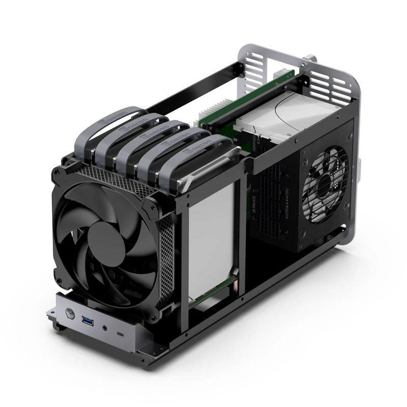
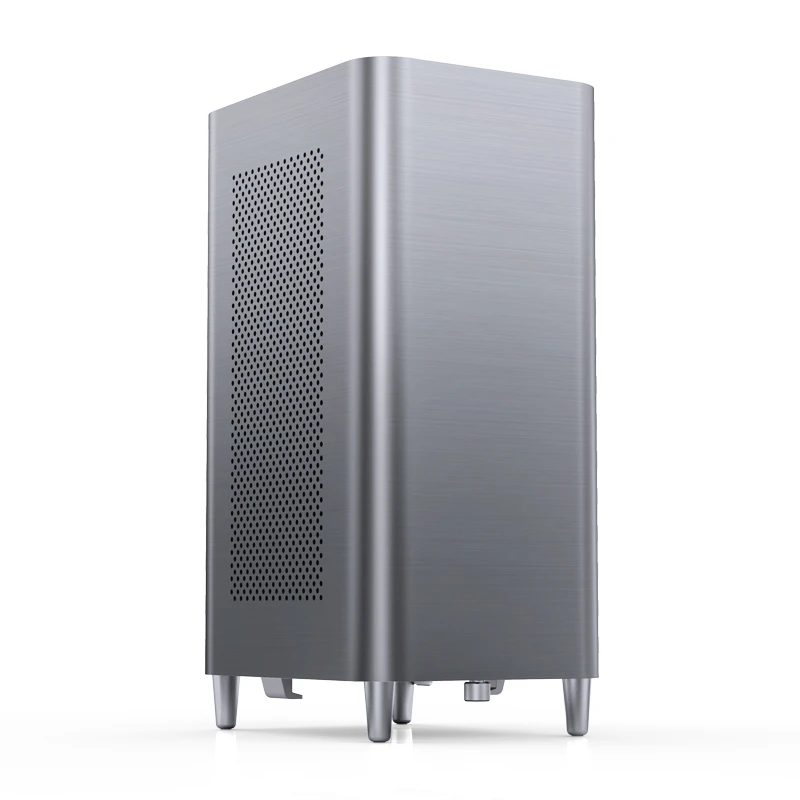
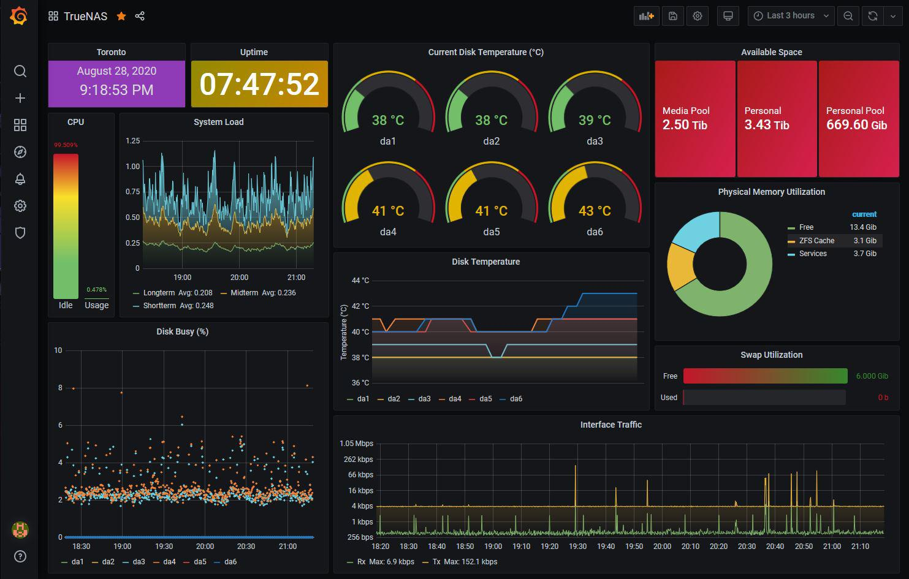

# N1NJA

> My personal cloud platform

  
  

<!--  -->

# Index
- [About](#about)
- [Parts List](#parts-list)
- [Build](#build)
- [Configuration](#configuration)
- [Backup](#backup)

# About
**Why**
- [**Cloud storage** = **renting your data indefinitely** + **high price tag**](https://www.google.com/aclk?sa=L&ai=DChsSEwjd8rWKtsOPAxWzM0QIHaI0EUMYACICCAEQABoCZHo&ae=2&co=1&ase=2&gclid=CjwKCAjwlOrFBhBaEiwAw4bYDVFJtEVmHAiWWus9C_fR6T9uFj8nsmqRqwuAlSRycUebBu9VIe9daxoCo-wQAvD_BwE&cid=CAASJeRoM32ydEo4Mj6KEJXtGzYshves0OKPl_nKTWlpffLx7Kn6RNc&cce=2&category=acrcp_v1_71&sig=AOD64_38ICUXGpzQKsSPhOBgZoR0--2NYw&q&nis=4&adurl&ved=2ahUKEwjV5LCKtsOPAxXfOkQIHXtSJNYQ0Qx6BAgLEAE)

**This NAS will provide**
- A secure, scalable, and automated personal cloud & file manager
- Self hosted password manager w/ private, encrypted credential storage
- Potentially a home media streaming server for movies, TV shows, and music
- ...

**This NAS will feature**
- TrueNAS Scale OS with ZFS file management
- A compact M-ITX build in a Jonsbo N1 case
- An initial 16TB of storage

**Next Upgrade**
- Drive replacement: WD Red Pro 8TB ~ 6 years (2031)
- Drive addition: TBD
- NAS refresh for new hardware ~ 10 years (2035)

# Parts list
| Part | Name | Price | Notes |
|:-|:-|:-| :-|
| **Amazon** | | |
| Case | [Jonsbo N1 M-ITX 5+1 Bay](https://www.amazon.com/N1-Mini-ITX-Chassis-Computer-Aluminum/dp/B09WZLHCZG/ref=sr_1_1?crid=1R63EVHLS8ZVR&dib=eyJ2IjoiMSJ9.dmREshv_ch7Utyy-wcbWzWdzcbt1d2cu1GqfLu1j048Lhj76tSJskcfPepIbbd08uW2xfDpyjIJMFigzJR-l5qK-HwAwLgPl2e3UXonzjvuhHlbhbm_eOz6WwX3nCoL4AlevKL4Hy0A82TcN75_TbSfjxcrlvLtPOYED0Xya5nwa2DWxFeltDEdb2dV_o-oU7QMopMka3s1-9BCTFIfucmT_mv9plnXFVhwf5swQFpw.MoLw4Rza8C_jrlpTGynqiAZZvdcHmg67m6tx2JpBJnQ&dib_tag=se&keywords=jonsbo+n1&qid=1757801428&sprefix=jonsbo+n1%2Caps%2C184&sr=8-1) | $140 | |
| Motherboard | [ASUS PRIME H610I-PLUS](https://www.amazon.com/ASUS-PRIME-H610I-PLUS-Motherboard-Mono-out/dp/B09XJQTQN1/ref=sr_1_1?crid=39LFB6UCM3GCK&dib=eyJ2IjoiMSJ9.j5Yw_YU_zxnkaY91q09RsHWbfm3Dc-OPQGDl6mrRyl_JdVGAwkv2iUwS6dwA3FquI-C9iFzxonZY4tLWnU1sCE2tbEmq15Ns-1hla7ofxlwtAc584sTed-xa09f0VD95MZ9pJVmPCRZnbf_y400H3GVYSbV65BRfHH-KWxyIbfciQDOiBUDopUSTR6ncrNVtL217hJsHatmIG1v4xa8kE_zFAnpq9O_uaoUClqV2Yxc.lmpkfZYz1GM-BCjJaZDZRUe11p3htWNurU-Bs4gRydc&dib_tag=se&keywords=ASUS+PRIME+H610I-PLUS+4+SATA&qid=1757113365&sprefix=asus+prime+h610i-plus+4+sata%2Caps%2C258&sr=8-1&ufe=app_do%3Aamzn1.fos.9fe8cbfa-bf43-43d1-a707-3f4e65a4b666) | $113 | Supports integrated graphics, was used in recent N1 build |
| CPU | [Intel Pentium Gold G7400 Dual-core (2 Core) 3.70 GHz Processor](https://www.amazon.com/Intel-Pentium-G7400-Dual-core-Processor/dp/B09Q87W31F/ref=sr_1_1?crid=3N4X3DQUF7F0C&dib=eyJ2IjoiMSJ9.f9SG6SfxVabSpig4qdOcvIjYie7Sy6EFQL1wkzUeDHH5p5hGUxIOQMckYDv3axE8M8ceO4kuWY7hHFymTxXpqSMY_AlKGP92VWGduW859Gjh5OCEz2P1WbliZPv9CD3EUBMThxFzaXHjMP_Hz-Y2PAB8zLwuUXjF-DANtvWM46Fo7g2AAm4wsx-_uUB_lIrP6kLyRZF2oWWCT1yu11haesowswWSqRrZhDlfKjtsWnw.ZkQPUCqtPAgtxkVgQumSex8IBb6v_0s9lq1hrQ6RkFw&dib_tag=se&keywords=Intel+Pentium+Gold+G7400+Dual-core+%282+Core%29+3.70+GHz+Processor+-+Retail+Pack&qid=1757183782&sprefix=intel+pentium+gold+g7400+dual-core+2+core+3.70+ghz+processor+-+retail+pack%2Caps%2C202&sr=8-1) | $70 | Integrated Graphics, comes with cooler |
| PSU | [Silverstone ST30SF V2](https://www.amazon.com/SilverStone-Technology-Factor-Bronze-ST30SF-V2-USA/dp/B07WM92Y4T/ref=sr_1_1?crid=1WPJEHYLYS1G4&dib=eyJ2IjoiMSJ9.VFgvDPRfuKDKCIRoSw_7eIU9uQgc5627dAD6TPHOLAS-4FMeSckLxvbDW_oCOjX-eNYRz-xJBZEAJqCGb5ozUvuLzBOxCGgN-e8IP4INs_feYTFmTpzk8I_JHjlpgVUHuudeoGOpnUW4P6u-wJB-m1PbmhqF-Yr9TNyQEJd6S-jFpx-0TlYqAZptK3wgkHxWyEVK28-KSCoSpS8GDU1rz6nhgVfTKoTcGdI4uEzF7GI.XquHhXNeoGobmuUla0lkO789cqii8gOiSqN97E_pJj8&dib_tag=se&keywords=SilverStone%2BST30SF-V2%2B300%2BW%2BSFX%2B(80%2BPLUS%2BBronze)&qid=1757112835&sprefix=fsp%2B550w%2Bsfx%2Bdagger%2Bpro%2Caps%2C361&sr=8-1&th=1) | $85 | |
| RAM | [CORSAIR VENGEANCE LPX DDR4 RAM 16GB](https://www.amazon.com/Corsair-VENGEANCE-3200MHz-Compatible-Computer/dp/B07RS1G6XW/ref=sr_1_2?crid=2CM7ENCFBYJK9&dib=eyJ2IjoiMSJ9.r1s1DniWVhlIH3HskYkjTaqH5po_p3BXDUHGO-2i_tduc8r5oqUrBmGJC059ZYvruoy5qR7zhiilht-ucMg5TKLT-JbMmmxGF8niXOOKaupYGMl9ZhGlQQ7FAgg_PJPW8TWbF9EEEJP06_rpmZiIW5I7fF38gIW9pa2rvYN8W2xN0uGt9bGc-gczxby5UL19nX7GOYoZiEIowKXWNwkYZgl2MWzy6jn1cyJAMBb5YLA.X_N4GfgtiovvUFdPnNWs9LsJMRRWKBb4TWwTIiYGUg0&dib_tag=se&keywords=Corsair+Vengeance+LPX+DDR4-3200&qid=1757116381&sprefix=corsair+vengeance+lpx+ddr4-3200%2Caps%2C282&sr=8-2) | $48 | |
| Boot SSD (NVMe) | [Patriot Memory P320 128GB](https://www.amazon.com/Patriot-P320-128GB-Internal-SSD/dp/B0D4RD18YV/ref=sr_1_5?crid=30SJVP6YUOR0A&dib=eyJ2IjoiMSJ9.AuUdwiEvQjxl6-O8arMSRacmYP7Epn806LGyiSjFukJgfQUERhsVN4_Gdhsp3klDYhOKq1008zC_Cvzyz3qAYbswYte14GiLjX4-Bkk6E3Yef9vE37FoJylB5Nab5McxiFoJ-wcq5Lhw_w2QoSeYmEusbpuElEDBgzXtkxfXf-f_ecav4KwL2M0X1DJzsg4YA2lcIGdlB0voP0UUEi-TKVF1kq2_SbXuzxc0OvocEfU.wNcctVda978FTY9JJpOIJ5is31RWr1gUgZ0Q5OrZBgE&dib_tag=se&keywords=nvme%2Bssd&qid=1757120200&sprefix=nvme%2Bssd%2Caps%2C234&sr=8-5&th=1) | $16 | TrueNAS needs bootdrive |
| SATA Cables | [3-Pack 90 Degree SATA Cable - 18 Inch](https://www.amazon.com/Cable-Matters-3-Pack-Degree-Right/dp/B018Y2LEBE/ref=sr_1_2_sspa?dib=eyJ2IjoiMSJ9.yBTbe_B6Fd3gQobKzqSSzYafsi24jGyzSP_yihGMzXbSJ1HoQoXeV-bioZjY1Zzu0C8qQPM6yP8LBGYpRnV2CUut62rUAbxSRYhuLHBfEEyxqrzonKO8EZ2DqPQrEq38230MRTkfcBKBz1yNCzYQniXH_Ef876XWUxK3cJuFW0L2mPDqVUQ6ZX5wb8PSEgQYSxnSSk2HY9aid5YumoWgstxLvGx_UH4XYC0rrWQQBbU.xd8c23i_dHl9w3pjJZL9KVra5CZc4s111Ld_dQFD8ko&dib_tag=se&keywords=cable%2Bmatters%2Bsata%2B6gbps%2B18%2Binch&qid=1757139177&sr=8-2-spons&utm_source=chatgpt.com&sp_csd=d2lkZ2V0TmFtZT1zcF9hdGY&th=1) | $6 | |
| | | $37 tax | |
| **Micro Center** | | | |
| Drives | [2 x Seagate Ironwolf 4TB NAS HDD ST4000VNZ06](https://www.microcenter.com/product/690298/seagate-ironwolf-4tb-5400-rpm-sata-iii-6gb-s-35-internal-nas-cmr-hard-drive) | $200 | CMR > SMR, 3.5" |
| | | $15 tax | |
<!-- | Drives | 2 x WD Red Pro 8TB WD8001FFWX [LINK1](https://www.ebay.com/itm/267217302405) [LINK2](https://www.ebay.com/itm/286707247051) | $221 | CMR > SMR, 3.5" | !-->
<!-- | | |$33 tax + ship  | | !-->

**NAS TOTAL = $515**

**DRIVES TOTAL = $215**

_As of Sep 2025_

## Build
<!-- 
Install the controller / OLED bases, reset button, trrs jack, controller, and oled.
 -->
<!-- 
For the controller use the gold pins and for the OLED use 0.5mm copper wire
 -->
<!--  -->

## Configuration

## Backup
> A home NAS is not a backup, it is primary data storage

I will be going with a cloud computer backup - [Backblaze](https://www.backblaze.com/cloud-backup/personal)
- Full NAS backup for a fixed $9 / month, as of Sep 2025
- Another good option is to store redundant offline drives that you rotate frequently

## Resources

More

  
- [FUTO Self Managed Guide](https://wiki.futo.org/index.php/Introduction_to_a_Self_Managed_Life:_a_13_hour_%26_28_minute_presentation_by_FUTO_software)
- [HDD Prices](https://diskprices.com/)
- https://github.com/JoeSchmuck/Multi-Report
- [Server dashboard](https://dashy.to/)

Builds
- [estevez N1 Build](https://www.reddit.com/r/HomeServer/comments/1l32zlv/i_built_a_nas/)

